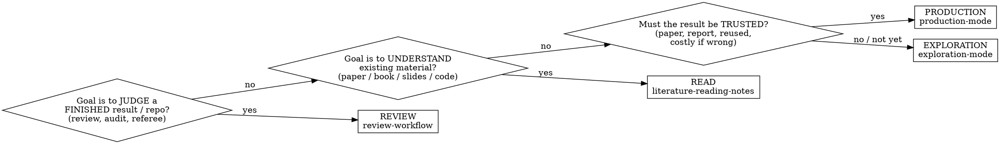

# Research Mode Router

## Overview
Every research task runs in one of three modes — plus an independent **Review** workflow for judging
finished work. Picking the wrong one is the most common source of waste (over-engineering a throwaway
check) or of costly error (trusting a quick-and-dirty script).
**Decide the mode first, then follow that mode's skill.**

## Pick the mode

| Mode | You are… | Skill | Output |
|------|----------|-------|--------|
| Review | judging a finished result / repo / manuscript | `review-workflow` | sign-off or referee report |
| Read | understanding a paper/book/slides/code | `literature-reading-notes` | thorough notes |
| Explore | probing a question whose answer shape is unknown | `exploration-mode` | one-line `FINDINGS.md` + saved plot |
| Production | computing a result that must be trusted | `production-mode` | acceptance-gated deliverable |

Review is **independent of production**: it is never a pipeline stage, and it can run on work produced
anywhere (your pipeline, a collaborator's repo, a manuscript).

## The firewall (non-negotiable)
**Exploration code can never be promoted to a production result.** It tells you *where to look*, not
*what the answer is*. To produce a trusted result, restart from `theory-derivation` (DERIVATION.md).
A dirty-script number that reaches a paper is the most expensive mistake in the whole workflow.

## Domain packs
Inside a mode, subject-specific technique skills stack on top automatically (e.g. a
`topological-insulator` pack adds its subject techniques). The router and the three modes are
subject-agnostic; the domain pack supplies the physics.

## Common mistakes
- Defaulting to Production for something 20 minutes of exploration would answer.
- Staying in Exploration when the result is heading into a paper (upgrade — see `exploration-mode`).
- Skipping Read: coding a model you have not yet derived or understood.
- Treating review as the tail of Production — review is a separate workflow with a fresh, zero-trust
  mindset (`review-workflow`).
